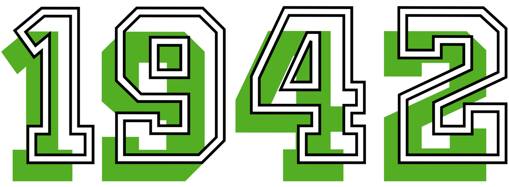
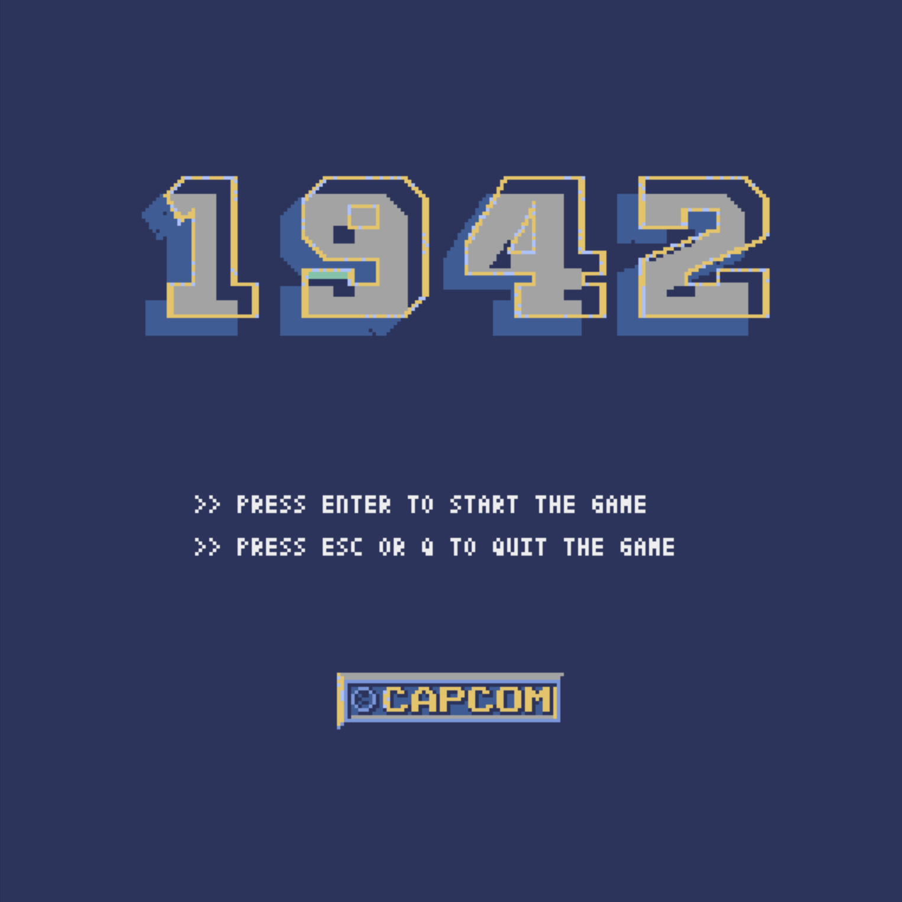

# 

The objective of the project is to implement the video game 1942. The game is a shooting game where the player controls an airplane that must destroy enemy planes and avoid getting destroyed by enemy missiles. The game is set in a 2D scenario, where the player moves along the horizontal axis and shoots along the vertical axis. The game ends when the player is defeated by the enemies or when the player defeats all the enemies.

The project has been developed using the [Pyxel library](https://github.com/kitao/pyxel) in Python, a retro game engine created by Takashi Kitao in 2018.

The video game is developed through classes that work cooperatively through their respective attributes and methods.

<p>



</p>


# Content

- [Execution](#execution)
  - [Pyxel Installation](#pyxel-installation)
    - [macOS](#macos)
    - [Windows](#windows)
    - [Linux](#linux)
  - [Run the Game](#run-the-game)
- [Description of Classes, Attributes, and Methods](#description-of-classes-attributes-and-methods)
  - [Board](#board)
  - [Enemy](#enemy)
  - [Plane](#plane)
  - [Shot](#shot)
  - [Background](#background)
  - [Island](#island)
  - [Explosion](#explosion)
- [Description of Used Algorithms](#description-of-used-algorithms)
  - [generate_enemies](#generate_enemies)
  - [stop_game](#stop_game)
  - [reset](#reset)
  - [check_collision](#check_collision)
- [Functionalities](#functionalities)


# Execution

## Pyxel Installation

### macOS

After installing [Python3](https://www.python.org/) (version 3.7 or higher), run the following command:

```sh
python3 -m pip install -U pyxel
```

If you use Python3, which is installed by default on macOS, please add `sudo` to the beginning of the above command to enable `pyxel` command.

### Windows

After installing [Python3](https://www.python.org/) (version 3.7 or higher), run the following command:

```sh
pip install -U pyxel
```

If you install Python using the official installer, please check the `Add Python 3.x to PATH` checkbox to enable `pyxel` command.

### Linux

After installing the SDL2 package (`libsdl2-dev` for Ubuntu), [Python3](https://www.python.org/) (version 3.7 or higher), and `python3-pip`, run the following command:

```sh
sudo pip3 install -U pyxel
```

## Run the Game

After installing Pyxel and either downloading or cloning this repository, run the following command:

```sh
python3 main.py
```


# Description of classes, attributes, and methods

For the development of the project, classes have been used to represent the different objects of the game. Some of them, such as the enemies, have different types that have been derived through class inheritance. This means that the child classes inherit all the information from the parent class and modify the functionalities that differ from it. In this section, we will detail the most important points of each of the implemented classes.

It is worth noting that, in general, the main attributes of each class are the coordinates (x, y) and the sprite bank for the visuals, as well as their active appearance, sprite.

## Board

The Board class is the core of the project. It is responsible for initializing all the content that will be displayed to the user, as well as updating the different functionalities and drawing the content on the screen in each frame update. As for the attributes, it includes a plane (player), a list of enemies, and others such as the window (board) dimensions or the starting conditions. It has the `update` and `draw` methods, which are responsible for updating and drawing in each frame. Additionally, it has the `stop_game` and `generate_enemies` methods, which will be explained later. The `update` method includes several loops that iterate through the lists of enemies and shots, updating the game state according to the main requirements. It is worth noting that there are enemy loops that could be optimized by merging them into a single loop, but they have been kept separate to enhance code readability and comprehension.

## Enemy

The Enemy class represents each enemy generated during the game. In our case, enemies can be of four types: regular, red, bomber, and super bomber, which are represented by four child classes that inherit the attributes and methods from the parent class. Within the Enemy class, we have the `move` method, which allows the enemy to move depending on its direction. Additionally, we have the `animation` and `reset` methods. The `animation` method is responsible for selecting the enemy's appearance based on its type and direction. On the other hand, the `reset` method restores the enemy to its initial state, as explained later. Finally, we have used the Python "magic method" `__repr__` to represent the enemy for debugging purposes during development. In the child classes, in addition to modifications in the parent class's `move` method, we have a method called `check_collision`, which will be detailed in the section of implemented algorithms later on. The enemies have attributes to control data such as their list of shots, health, speed, and provided score.

## Plane

The Plane class represents the player's airplane in the game. It is responsible for shooting at enemies and can move freely using the arrow keys, as well as perform loops to avoid being shot down. The `move` method allows the player to move based on the direction. The `make_loop` method enables the player to perform a loop to evade enemy fire. The `animation` method handles the animation of the propellers and loops. Finally, the `check_collision` method detects collisions with other enemies or enemy shots, but it will be explained in detail later in the section on used algorithms. The plane has attributes such as its health, speed, list of shots, and remaining loops.

## Shot

The Shot class represents a shot fired by the player or the enemy. Depending on the type, a different appearance and direction are used based on the project's constants. It has the `move` method, which moves the bullet across the screen according to its direction and speed.

## Background

The Background class represents the game's background. It has the `move` method to move the content (only islands in our case) in each game frame. Additionally, we can see the `islands` attribute, which is a list containing all the Island objects that will be described next.

## Island

The Island class represents an island in the game's background. It has the `move` method, which allows the island to move at a certain speed. Furthermore, the appearance of the island varies depending on its type, so an attribute is used to determine it.

## Explosion

The Explosion class is simple. It is initialized with coordinates and has a different appearance depending on the desired explosion type. For example, the explosion of a bomber will be much larger than that of a regular or red plane.


# Description of used algorithms

Several algorithms have been implemented in the game's development, which are explained in the following methods. The most relevant ones are shown, but additional algorithms have been implemented to meet the needs of each functionality. In addition to this, the `update` method of the Board class contains the necessary algorithms to generate and remove enemies, shots, and other objects such as explosions or islands that are generated during the game.

## generate_enemies

This method is found in the Board class and is responsible for generating enemies automatically and randomly, following the formation patterns and minimum number of each enemy type indicated in the requirements. At a minimum, it generates 20 regular planes, 5 red planes, 2 bombers, and 1 super bomber, although more can be generated.
All enemies are included in an inactive enemy list (which will be activated at random time intervals). The generation of regular enemies is done in formations of 10 or 20, red enemies are generated in formations of 5 planes, and bombers and super bombers are generated individually.

## stop_game

This method is found in the Board class and is responsible for stopping the game when a player loses a life. The method changes the required control variables to display the corresponding screen, and then it clears the entire screen content and stores it in lists so that it can be displayed again when returning to the game. To achieve this, the `reset` method is used, which will be explained next.

## reset

The `reset` method belongs to the Enemy class and, therefore, is common to all enemies in the game. It sets the coordinates to their initial values set during the enemy generation at the start of the game, allowing the enemy to reappear. Additionally, it sets the direction that they will follow, which is the same as the one they used initially.

## check_collision

This method is found in both the Plane class and each child class of Enemy. It compares the coordinates of two objects to determine if a collision exists and what action needs to be taken accordingly.


# Functionalities

The player can move using the arrow keys and shoot by pressing either the S key or the SPACE bar. The player can perform a loop by pressing the Z key. If a player's shot hits an enemy, the enemy is eliminated, and the score counter increases. On the other hand, if the player is hit by an enemy's shot or collides with an enemy, the player loses a life. All objects have animations, such as shot appearances, propeller movement, explosions, or appearance changes depending on the direction. It should be noted that enemy generation is done automatically and randomly, following formation patterns and the minimum number of each enemy type.

In addition, several extra functionalities have been included. These are:
- When all red planes are destroyed at once (5 red planes traveling together in formation), a bonus is received. The player will receive two extra loops and the ability to shoot double for a random number of seconds (never more than 5).
- The game features background music during gameplay, as well as sound effects for shooting, being hit, colliding with another enemy, or shooting down enemies.
- Various animations (screens) have been implemented throughout the game:
  - Start animation: To begin the game, the player needs to press the ENTER key. They can choose to exit at any time by pressing the Q key or ESC key.
  - Life lost animation: If the player is shot down or collides with another enemy, they lose a life, and the game pauses. If the player presses ENTER, they can resume the game with one less life. They can choose to exit at any time by pressing the Q key or ESC key.
  - End animation: If the player loses all lives or wins, a final screen is displayed. If the player wins, the total score achieved is shown. They can choose to exit at any time by pressing the Q key or ESC key.

# Known bugs

Some bugs have been detected during the testing of the game which are detailed below and will be fixed in future versions:

- There are some crash problems with shot collisions in specific cases.
- The game may perform strangely when the player lives end and the user does not exit the game.

Please report any other bugs you may find during the game's execution.
